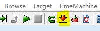

# 引入HSM工程操作手顺


## 1. 修改DEBUG环境

> 覆盖GHS编译器：
>
> 拷贝 file:\\\\10.52.245.114\03_sw\02_SW\MCU\E2\comp_201517.7z 中的内容 覆盖 C:\ghs\comp_201517目录下内容

## 1.2. 修改MCU状态修改

### 1.2.1. 编译工程

```python
# 进入命令行

# 进入Release脚本目录
cd %project%\Build\Integration\Release

# 安装cryptography 电脑能联网
pip install cryptography
# 安装cryptography 电脑不能联网
pip install whl\cryptography-3.2.1-cp38-cp38-win_amd64.whl

# 运行Release脚本
Release.bat

# Release脚本命令如下：如果需要释放DEBUG版本HSM需要执行命令 Release.bat -D
Release [options]
Basic options:
    /BM Uncompile the boot manager
    /FA Uncompile the FirmwareA
    /FB Uncompile the FirmwareB
    /HSM  Uncompile the HSM
    /ALL  UnCompile the  boot manager/FirmwareA/FirmwareB/HSM
    /M Unmerged projects

    -D Compile the HSM for Debug
    -ALL Recompile all projects
    -H print basic usage information


```

###  1.2.2. 下载工程

```python
# 进入命令行

# 进入downlode脚本目录
cd %project%\Build\Integration\Release

# 运行downlode脚本 downlode.bat与downlode-fast.bat选择其中一个运行，必须再Release.bat运行成功之后才能运行downlode脚本
downlode.bat (不需要电源供电)
downlode-fast.bat (需要电源供电)

```

## 2. DEBUG工程

> 1. 打开需要调试的工程，进入调试界面
> 2. 连接E1  
> 3. 修改连接配置：替换dvf文件为 \Build\Scripts\dr7f701651i.dvf
>
>  
>
> 4. 连接E1 等待出现下面界面并选择 Id 0 CPU ,点击OK
>
>  
>
> 5. 下载数据 
> 6. 下载完成后出现如下界面
>
>  
>
> 7. 运行程序
>    1. 选择 Id 1 按 F5运行程序Id 1状态变为Running.
>    2. 选择 Id 0 按F5运行程序 Id 0变为Running
>    3. 程序正常调试


