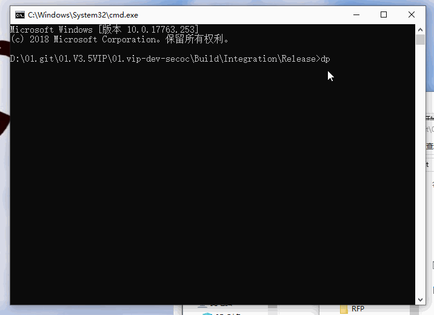

# 工具使用说明
> 此工具集分两部分
>
> 1.  [Release.py](Release.py) 用于释放带CMAC签名的MCU烧录文件，烧录文件有4块，分为，BootManage ,FirmwareA,FirmwareB,HSM,最终生成一个文件 Firmware.hex用于烧录。
> 2.  [downlode.bat](downlode.bat) 用于烧录引用Firmware.hex文件，并启用HSM功能。


## 1.  [Release.py](Release.py) 

 

```python
# 命令行执行 Release.py
python Release.py
```

执行完成之后根目录会多次 output 目录,内容如下

```python
OUTPUT
│  Firmware.hex				# 带CAMC签名的MCU数据
│  
└─data
        BootManage.bin		# 由BootManage hex填充生成的BootManage二进制文件
        BootManage.hex  	# 编译生成的BootManage hex文件
        BootManage_Cmac.bin # 带 CAMC签名的由BootManage二进制文件
        FirmwareA.bin
        FirmwareA.hex
        FirmwareA_Cmac.bin
        FirmwareB.bin
        FirmwareB.hex
        FirmwareB_Cmac.bin
        HSM.bin
        HSM.hex
        HSM_Cmac.bin
```

## 2.  [downlode.bat](downlode.bat) 

在使用[Release.py](Release.py) 生成文件之后可以使用 [downlode.bat](downlode.bat) 将生成完成的文件下载到MCU中


 


## 3.  [Release.bat](Release.bat)
建议采用批处理[Release.bat](Release.bat)进行软件释放，批处理执行命令如下,没有参数的情况下，为释放HSM非debug版本，增量编译项目
```
Release [options]
Basic options:
    -D 释放 HSM debug 版本
    -ALL 重新编译所以项目
    -H 显示帮助解密
```

